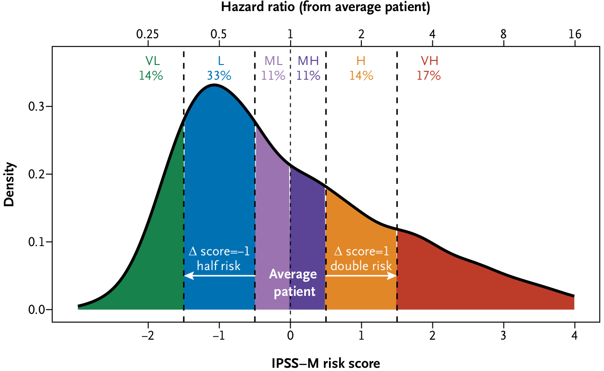

[](https://evidence.nejm.org/doi/full/10.1056/EVIDoa2200008)

#  **Code and Data accompanying _Molecular International Prognostic Scoring System for Myelodysplastic Syndromes_**

_[Bernard E, Tuechler H, Greenberg PL, Hasserjian RP, Arango Ossa JE et al. NEJM Evidence 2022.](https://evidence.nejm.org/doi/full/10.1056/EVIDoa2200008)_



## :open_file_folder: Repository Structure

- **`data/`**: the folder contains the clinical and molecular data necessary to reproduce the results of the study. See the [README](./data/README.md) in the **`data/`** folder for details about data structure.

- [IPSSM.ipynb](./IPSSM.ipynb): the jupyter notebook with R code to reproduce results and figures.

- [IPSSM.html](./IPSSM.html): an html version of the notebook.

- **`bed/`**: the target bed file (hg19) used for NGS capture in the study.


## :rocket: Getting started with this repository


### Clone the repository

To clone this repository on your local computer please run:

```shell
$ git clone https://github.com/papaemmelab/IPSSMstudy
```


### R packages you need to install:

```R
# run in an R console
install.packages('ggplot2',      repos = 'http://cran.us.r-project.org')
install.packages('survival',     repos = 'http://cran.us.r-project.org')
install.packages('survminer',    repos = 'http://cran.us.r-project.org')
install.packages('cmprsk',       repos = 'http://cran.us.r-project.org')
install.packages('cowplot',      repos = 'http://cran.us.r-project.org')
install.packages('dplyr',        repos = 'http://cran.us.r-project.org')
install.packages('tidyr',        repos = 'http://cran.us.r-project.org')
install.packages('ggsci',        repos = 'http://cran.us.r-project.org')
install.packages('ggpubr',       repos = 'http://cran.us.r-project.org')
install.packages('RColorBrewer', repos = 'http://cran.us.r-project.org')
install.packages('MetBrewer',    repos = 'http://cran.us.r-project.org')
```

```R
# install the IPSS-M R package
install.packages('devtools', repos = 'http://cran.us.r-project.org')
library(devtools)
install_github("papaemmelab/ipssm", ref="master")
```

## :question: Question

If any question on the repo, feel free to contact [Elsa](https://elsab.github.io/).
